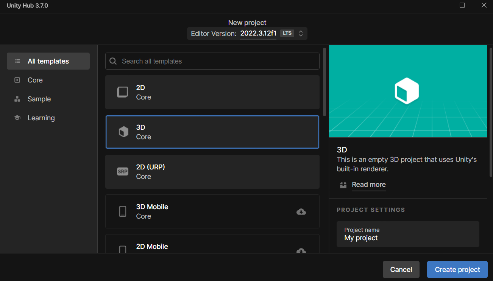
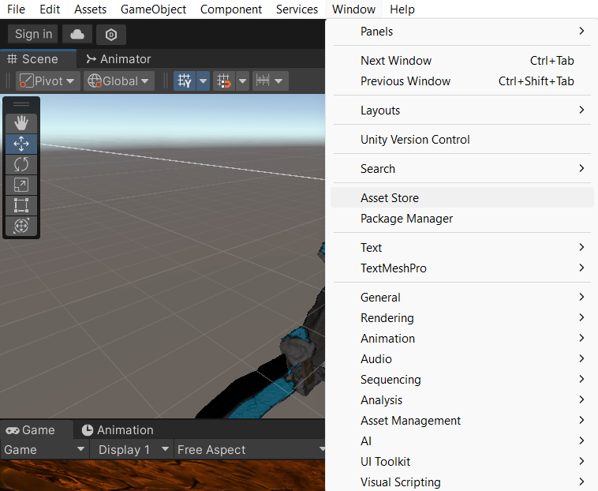

# Premiers pas avec Unity

## Quelle sera notre première création ? 👷‍♀️🎨
Imaginez votre propre petit monde, un endroit que vous pouvez modeler et remodeler à loisir. Eh bien, cette vision va bientôt devenir réalité! Vous allez lancer Unity et voir apparaître un espace de création qui n'attend que votre touche personnelle. 

## Développement:
Nous allons débuter par l'écran de démarrage pour créer votre nouveau projet. Imaginez-le comme une toile blanche sur laquelle vos idées prendront couleur :
- Sélectionnez "Nouveau Projet" et ressentez ce frisson du début d'une grande aventure 🎢.
- Nommez votre projet d'un titre inspirant qui reflète votre vision 🏷️.
- Familiarisez-vous avec le tableau de bord du projet, là où toutes vos créations prendront forme 📋.

## Qu'y a-t-il dans la boîte à outils ? 📦🎮
Unity regorge d'assets prêts à être utilisés, comme des blocs de LEGO vous permettant de construire rapidement et facilement :
- Visitez l'Asset Store, un marché rempli de trésors gratuits. Sélectionnez des textures, des modèles 3D ou des effets sonores pour personnaliser votre scène 🏰🌳🎵.
- Importez ces éléments dans votre projet et observez votre univers prendre vie, pièce par pièce 🔌.
- Pendant que vous construisez, ponctuez chaque réussite avec un emoji pour célébrer le progrès et captiver l'attention 🌟.

## Quelle aventure nous attend ensuite ? 🧭
Maintenant que votre monde a sa forme, ses couleurs, et sa bande-son, il est prêt à être animé! Nous nous apprêterons à introduire la logique qui souffle l’esprit dans la matière. La prochaine étape vous initiera aux scripts C#, le langage qui sert de fil d’or à toute la trame de vos jeux. Imaginez pouvoir faire danser les objets à votre gré... Nous allons vous montrer comment! 🕺💻

[Principes de base de la programmation](https://github.com/g404-code-gaming/Cour-Intro-Unity/blob/main/Cour/2.Principes%20de%20base%20de%20la%20programmation.md)
