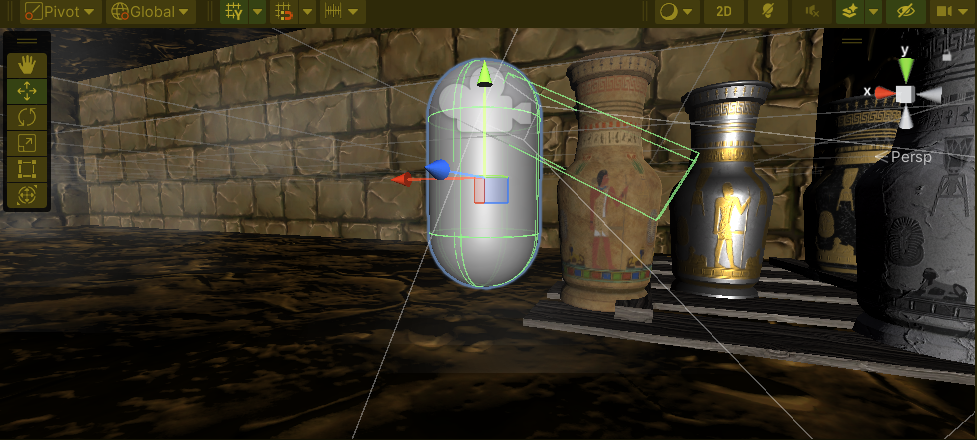

# Gestion des Interactions et Création d'Inventaire
## Comment enrichir l'expérience avec des échanges captivants ? 🤖🔄
Armés des bases de la programmation, il est temps de permettre à nos créations d'aller au-delà de la simple réaction à des commandes. Donnons-leur la capacité d'interagir de manière plus authentique et riche, que ce soit avec l'environnement, d'autres personnages ou les objets qu'elles peuvent porter et utiliser.

## Développement :
Perfectionnons nos talents de conception avec les interactions avancées d'Unity :
- Mettez en place des systèmes de collisions et de triggers pour des interactions dynamiques et variées qui donnent vie à votre monde virtuel 🌌.
- Étudions les concepts de raycasting pour détecter et réagir aux éléments éloignés sans contact direct 📡.
- Apprenons à construire un inventaire fonctionnel qui permet au joueur de collecter, utiliser et gérer une variété d'objets pendant son aventure 🎒🔑.

## Quelle est la prochaine étape de notre parcours créatif ? 🚀
Ayant posé les bases d'un monde interactif, nous allons à présent nous attaquer à la façon dont tout cela est présenté au joueur. L'étape suivante nous amènera à explorer l'UI, à apprendre à concevoir une interface utilisateur qui non seulement informe le joueur de son statut et de ses possessions, mais l'invite également à se plonger encore plus profondément dans l'expérience du jeu. Préparons-nous à rendre notre inventaire non seulement fonctionnel mais aussi harmonieux et intuitif. 🖌️🗃️

[Conception de l'Interface Utilisateur (UI) dans Unity](https://github.com/g404-code-gaming/Cour-Intro-Unity/blob/main/Cour/4.Conception%20de%20l'Interface%20Utilisateur%20(UI)%20dans%20Unity.md)
