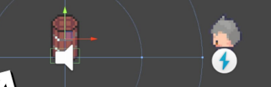

# L'Art de l'Audio dans Unity
## Comment capturer l'essence sonore d'un univers ? 🎵🌌
L'audio est une composante cruciale qui donne de la profondeur et de l'émotion aux jeux. Un son bien placé peut transformer une simple action en un moment mémorable.

## Développement :
Dans cette partie, on va explorer les subtilités de l'audio dans Unity :
- Manipuler l'Audio Source et l'Audio Listener pour contrôler où et comment le son est joué et entendu 📢👂.
- Jouer avec la 3D audio pour donner une dimension spatiale aux sons, les rendant plus réalistes en fonction de la position du joueur 🌍🔊.
- Créer des musiques de fond et des effets sonores qui s'adaptent au gameplay, améliorant l'immersion et la réactivité de l'environnement 🎶🕹️.

## Avant de se lancer :
N'oublions pas le design sonore, où l'on choisit avec soin chaque son pour créer des ambiances uniques. Le choix des instruments, des rythmes et des textures sonores est un art en soi, qu'on aura la joie d'explorer.
