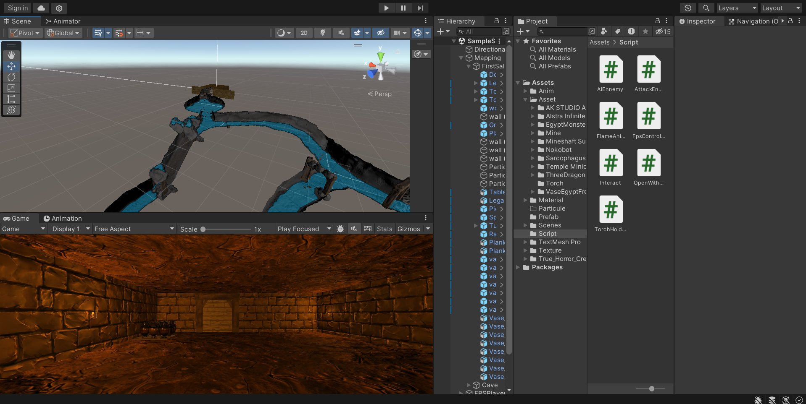

# Introduction à Unity

## D'où vient la magie ? 🧙‍♂️✨
Plongez dans le monde fascinant de Unity, le creuset où s'assemblent des univers infinis! Ici, vous apprendrez à façonner des galaxies de pixels 🌌, à animer des héros 🦸 et à donner le souffle de la vie à vos rêves les plus fous 🌈. 

## Qu'y a-t-il dans la boîte à outils ? 🛠️
Unity, c'est votre baguette magique de développeur! Elle s'accompagne d'une interface qui est un véritable terrain de jeu 🎮 :
- Scène : Ce n'est pas juste un écran, c'est votre terrain de construction personnel, où chaque bloc compte 🏗️.
- Hierarchy : Un fil d'Ariane qui dévoile les couches de votre création 🔍.
- Game : Le miroir reflétant l'âme de votre jeu, là où la magie devient réalité 🕹️.
- Project : La caverne d'Ali Baba remplie de trésors pour agrémenter votre monde virtuel 🎨.
- Inspector : Le grimoire qui recèle les formules pour inventer les lois de vos terres imaginaires 📜.

## Et ensuite, on va où ? 🚀
Ceci n'est que le prélude de votre épopée de créateur de jeux. Avec les bases en poche, nous nous aventurerons bientôt dans la pratique. Préparez-vous à tisser votre premier chef-d'œuvre dans le voile de Unity. Vers l'infini de la création et au-delà! 🌠

[Premiers pas avec Unity](https://github.com/g404-code-gaming/Cour-Intro-Unity/blob/main/Cour/1.Premiers%20pas%20avec%20Unity.md?plain=1)
